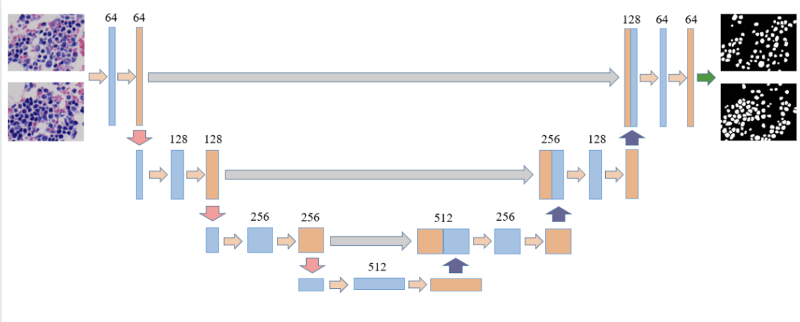

# Satellite Image Segmentation with U-Net Model and Sentinel-2 Data  

**Sage McGinley-Smith**  
*Mordecai Lab, Stanford University*  
*CS 191W Fall 2024*  

This GitHub is intended as a resource for implementing U-Net binary image segmentation of Sentinel 2 satellite imagery. It uses the example of classifying pineapple plantations in Costa Rica as demonstration of the pipeline and modeling decisions. Below is a brief outline of the contents of this document, which contain implementation instructions as well as background and context and useful resources. This project was completed as a senior project in the Mordecai Lab at Stanford University. It is organized as follows: 
- Section 1: Implementation Instructions
- Section 2: Project Context and Background
- Section 3: Why Deep Learning + U-Net Explanation
- Section 4: Resources and Future Directions

---

## Section 1: Implementation Instructions
| Step and Platform       | Explanation                                                                                                                                                     | Code                                                                 |
|--------------------------|-----------------------------------------------------------------------------------------------------------------------------------------------------------------|----------------------------------------------------------------------|
| **Data Export in Google Earth Engine** | Follow the GEE code script to obtain an NDVI composite of Sentinel 2 imagery. The script rasterizes the label layer and exports it separately from the Sentinel layer, for which it exports red, green, blue, near-infrared, and short-wave infrared bands, as well as NDVI, NDWI, SAVI, and NDMI indices. It is important that you export these nine bands in order for the model to receive proper dimension images. If desired, select different geographic boundaries for export, different time interval for compositing, or different spatial resolution. Ensure the mask and all bands of the image are exported at the same resolution (script should do this automatically but is a good check). Export to desired folder in Drive. My exported data can be found [here](https://drive.google.com/drive/folders/1lBXCTNaDuvsb8-STUPYHI8o4GUu7GVK8?usp=sharing) | [GEE Code](https://code.earthengine.google.com/0d678008835c1601629c686fc5240a1) |
| **Set up GCP bucket structure** | Set up a GCP bucket by going to the GCP Dashboard and creating a new bucket. Create one folder called `sentinel-images` and one called `mask-images`. Within each folder, create a folder for each quadrant. Finally, create an authentication method and key using the instructions in the `GCP_Authentication_Instructions` image. | GCP_Authentication_Instructions |
| **Tile the images and store in GCP** | Use the Colab Notebook to chip up the Sentinel images into size 128 (height) × 128 (width) × 9 (bands) and the label images into size 128 × 128 × 1 (classification layer). Make sure that the GCP account, the Drive account where the images are stored, and the account executing the notebook are all the same. This step may take a while depending on how large your quadrants are. | [Colab Notebook](https://colab.research.google.com/drive/1HhO45GlW1zwEXomkEq) |
| **Split data into test, train, and dev folders.** |                                                                                                                                                                 |                                                                      |
| **Build, Train, and Export Model** | Use the Colab Notebook to build, train, and export a U-Net model. The notebook contains comments and instructions that explain how to make changes to training parameters and process as well as model structure, if desired. | [Colab Notebook](https://colab.research.google.com/drive/1NvR_bai-E3iY9AzIXbdICEdCkd3xOBpS?usp=sharing) |

---
## Section 2: Project Context and Background
Ultimately, the goal of this project is to build pineapple plantation distribution maps for 2020-present for the country of Costa Rica. The project uses data provided by researchers at Centro National de Alta Technología (CeNAT) which shows pineapple distribution from 2019. The project is motivated by a desire to understand the impacts of pineapple cultivation on dengue distribution across the country of Costa Rica. 

From a personal perspective, this project was motivated by several classes I have taken as a part of the Computer Science degree program. The first class was CS 131: Computer Vision, for which I implemented the random forest model aspect of this project. Details on that project, including the final report, can be found in the section below. The second class was CS 230: Deep Learning, for which I implemented the UNet model training aspect of the project. For more information on the deep learning topics discussed in this project, I recommend referencing the open source lectures from the class, which provide useful background on relevant present day deep learning theory and implementation. IN particular, the course on [machine learning basics](https://www.youtube.com/watch?v=CS4cs9xVecg&list=PLkDaE6sCZn6Ec-XTbcX1uRg2_u4xOEky0) provides useful background.   

---
## Section 3: Why Deep Learning + UNet Explanation
The input data to this project resembles data that can be fed into multiple machine learning algorithms. It contains pixels with 9 features (bands) per pixel, and one classification feature per pixel. A **Logistic Regression** model, which takes in the nine features and attempts to fit them to a multivariable function that can predict the output y, performs poorly on the data. When tested on a small subset of the pixels, it has a recall of only 0.1, meaning only 10% of the pixels that were pineapple plantations were actually classified as plantations in the test set. A brief example of this linear baseline implementation can be found [here](https://colab.research.google.com/drive/15PRkwwH_VYkhsdaJLXnFg37ElMhEaYo9?usp=sharing). Beyond logistic regression, and still in the traditional machine learning space, is **Random Forest**. Random forest is a more advanced machine learning model, capable of capturing non-linear patterns in the data due to its decision tree structure. As previously mentioned, Random Forest performed reasonably well for this project, but the results were not on par with the creation of a scientifically useful dataset. More details about that project and the Random Forest implementation can be found [here](https://github.com/sagems/pineapple_classification). It is important to note that both the Random Forest model and the Logistic Regression model use **pixel-based classification**, meaning they classify each pixel individually using the input features, without consideration of the nature of the surrounding pixels.

By contrast, **deep learning** models are advanced machine learning systems that use neural networks to process and analyze data. A simple neural network essentially consists of series of logistic regression layers with non-linear activation functions between each layer. For further intuition about the structure of basic neural networks, I recommend watching this [video](https://www.youtube.com/watch?v=aircAruvnKk&t=1003s). In a neural network, each layer extracts increasingly complex features from the input, enabling tasks like image recognition, natural language processing, and more. These models **excel at handling large, unstructured datasets**, with different kinds of models working better on different kinds of tasks. For image processing in particular, a specific kind of network called a Convolutional Neural Net (or CNN) is used. A **Convolutional Neural Network (CNN)** is a type of deep learning model designed to process grid-like data, such as images. It uses convolutional layers (2 and 3 dimensional filters) to automatically detect patterns like edges or textures by applying the filters to scan over the input. These patterns are then combined in deeper layers to recognize more complex features, making CNNs particularly effective for image classification, segmentation, and object detection tasks.

Although there is much more to say about deep learning and CNNs, for this particular project, it is most important to understand the U-Net model. The **U-Net model is a kind of CNN** that is often used to identify and outline specific regions in pictures, such as tissues in biomedical images, or pineapple plantations in satellite images. It works by first "zooming out" and expanding the images to have more channels, and then "zooming in" to output a final mask segmenting the image into different classifications. In the case of this project, the final mask image is binary, representing areas classified as pineapple plantations and non-pineapple plantations. I find this [youtube series](https://www.youtube.com/watch?v=ArPaAX_PhIs&list=PLkDaE6sCZn6Gl29AoE31iwdVwSG-KnDzF&index=1), which is the basis for the deep learning class I took this fall, very useful in explaining the concept of a CNN as it applies to image segmentation. Ultimately, the most important takeaway about CNNs vs traditional machine learning is that they **consider pixels in context, rather than as isolated data points**. An example U-Net architecture with biomedical image analysis is pictured below. 

---
## Section 4: Resources and Future Directions

Possible future directions for this project include: 
-	Exploring the potential for transfer learning on pretrained foundational models. Transfer learning is the process of retraining the last layers of a pretrained model on a particular dataset to leverage the similarities between image data of all sorts. This reduces training time and resources and improves generalizability. 
-	Earth Genome Earth Index: Once released globally in the spring, employ Earth Index to identify areas of pineapple plantation growth and distribution. Find more information about Earth Genome here.
-	Prediction: After a final model has been settled on, the raw images from 2020-2023 can be chipped up and classified to form the final dataset.  

Through the research process for this project, I found many valuable resources and met with researchers across the realms of spatial data and deep learning. I've attached a document with the most relevant notes from those meetings, and have linked several useful resources below. 

- [Consultation Notes](https://docs.google.com/document/d/1puVxFoWywQZErhmyTF4738MD0djCUVpMdM4hhl3lGUM/edit?usp=sharing)
- [Github Repository on Satellite Data + Deep Learning](https://github.com/satellite-image-deep-learning)
- [Colab notebook walking through a basic classification process](https://colab.research.google.com/github/climatechange-ai-tutorials/aquaculture-mapping/blob/main/Aquaculture_Mapping_Detecting_and_Classifying_Aquaculture_Ponds_using_Deep_Learning.ipynb#scrollTo=rSRCNgYzUwaf)
- [Vertex AI Guides](https://developers.google.com/earth-engine/guides/ml_examples)
- [Guide to Earth Engine and PyTorch CNN (Pixel-Based)](https://colab.research.google.com/github/google/earthengine-community/blob/master/guides/linked/Earth_Engine_PyTorch_Vertex_AI.ipynb)
